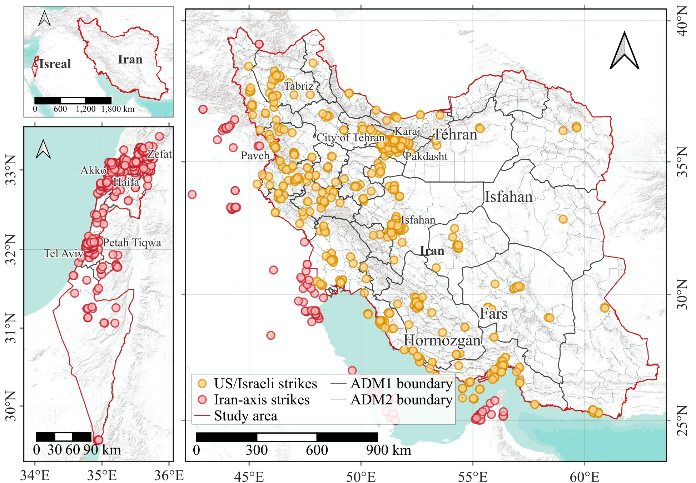
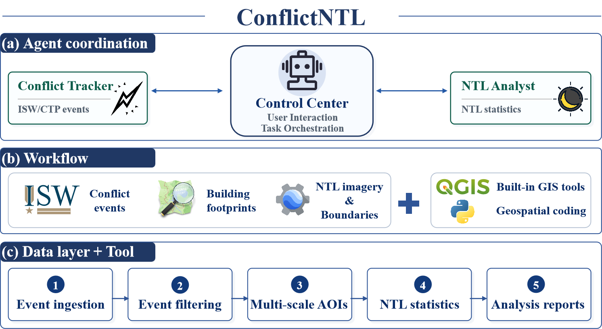
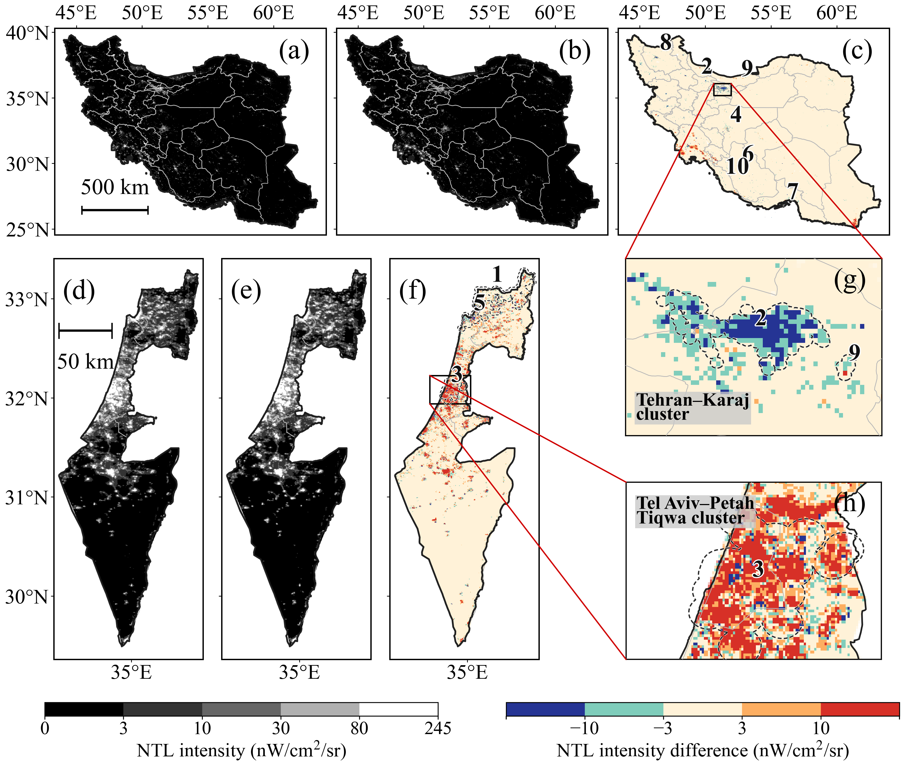

# ConflictNTL

ConflictNTL is a skill-guided workflow for automated nighttime-light (NTL)
analysis of conflict event streams. The system separates procedural knowledge
from executable capabilities: the skill guides event filtering, area-of-interest
generation, VIIRS Black Marble VNP46A2 statistics, and figure/table generation,
while MCP tools provide atomic reusable GIS operations.

This repository currently provides the public skill and selected figure previews
for the ConflictNTL case study. The full manuscript draft is not included in
this repository.

## Abstract

Nighttime light remote sensing is widely used to monitor conflict-related
changes in infrastructure and human activity, but existing workflows often rely
on manual event retrieval, image processing, and interpretation. ConflictNTL
encodes this workflow as an agent skill and a separately registered MCP-based
GIS tool layer. In the 2026 U.S.--Israeli military campaign against Iran case
study, the workflow retained 2,383 events and produced multi-scale NTL
statistics across provincial, city, and 3 km core-impact-cluster scales. The
results show conflict-period NTL reductions in several Iran-side clusters,
including the Tehran--Karaj cluster, while Israel-side clusters showed short
term fluctuations without sustained decline.

## Repository Contents

- `skills/conflict-ntl-analysis/`: Codex/agent skill for reproducing and
  adapting the ConflictNTL workflow.
- `mcp/conflictntl-gis-tools/`: standalone MCP server exposing atomic GIS
  operations such as geoBoundary download, point-polygon joins, AEQD buffers,
  and dissolved buffer components.
- `figures/`: selected manuscript figure previews.

Large raw datasets, Google Earth Engine credentials, local cache files, and the
full manuscript draft are not included.

## Figure Previews

### Study Area and Event Distribution

### Multi-Agent System Architecture

### Period-Mean and Difference NTL Maps

### Daily NTL Curves for 3 km Core Impact Clusters

## Skill

The reusable skill is stored in `skills/conflict-ntl-analysis/`. It includes:

- workflow and portability notes;
- data contract assumptions;
- QGIS/PyQGIS event-screening scripts;
- AEQD 3 km buffer-cluster and VNP46A2 statistics scripts;
- Figure 1, Figure 3, and Figure 4 plotting scripts.

The MCP tools are stored separately in `mcp/conflictntl-gis-tools/`. They are
not a full ConflictNTL workflow runner. The skill decides when to call MCP
tools, when to use a global QGIS MCP server, and when to execute
workflow-specific scripts.

Some scripts keep local path constants near the top of each file so they can be
retargeted to another workspace. Read
`skills/conflict-ntl-analysis/references/portability.md` and
`skills/conflict-ntl-analysis/references/workflow.md` before running the full
workflow.
